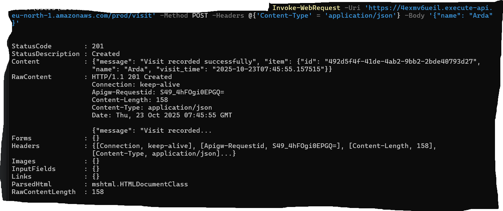
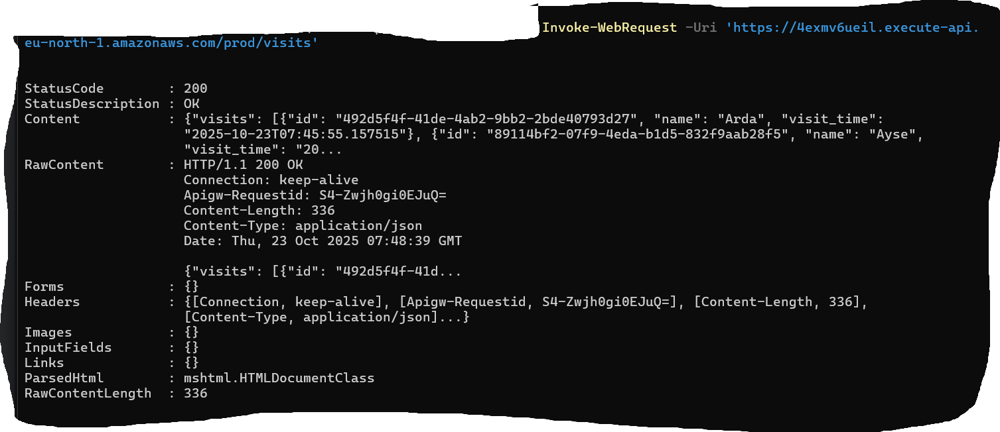

# v2: Serverless Ziyaretçi Defteri API (IaC Projesi)

Bu proje, basit bir "Merhaba Dünya" fonksiyonunun (v1), profesyonel, veritabanı entegrasyonlu ve Altyapı olarak Kod (IaC) ile yönetilen bir mikroservise (v2) dönüştürülmüş halidir.

Bu API, bir "Ziyaretçi Defteri" görevi görerek, `POST` istekleri ile gelen isimleri bir veritabanına kaydeder ve `GET` istekleri ile bu isimleri listeler.

**API Endpoint URL:** `https://4exmv6ueil.execute-api.eu-north-1.amazonaws.com/prod`

##  Kullanılan Teknolojiler (Teknoloji Stack'i)

* **Infrastructure as Code (IaC):** `AWS SAM (Serverless Application Model)`
* **İşlem (Compute):** `AWS Lambda`
* **API (Network):** `AWS API Gateway` (HTTP API)
* **Veritabanı (Storage):** `AWS DynamoDB` (NoSQL)
* **Güvenlik (Security):** `AWS IAM` (En Az Yetki Prensibi ile)
* **Dil (Language):** `Python 3.10`

##  Altyapı ve API Tasarımı

Bu proje, AWS konsolundan manuel olarak *oluşturulmamıştır*. Tüm altyapı (Lambda fonksiyonu, API Gateway endpoint'leri, DynamoDB tablosu ve IAM rolleri), `template.yaml` dosyasında kod olarak tanımlanmış ve `sam deploy` komutu ile deploy edilmiştir.

Bu yaklaşım, altyapının tekrarlanabilir, sürdürülebilir ve hatasız bir şekilde yönetilmesini sağlar.

### API Endpoint'leri ve Demo Çıktıları:

1.  **`POST /visit`**
    * Yeni bir ziyaretçi kaydı ekler.
    * **İstek Body (JSON):** `{"name": "Arda"}`
    * **Başarılı Yanıt (201 Created):**
        

2.  **`GET /visits`**
    * Veritabanındaki son ziyaretçileri listeler.
    * **Başarılı Yanıt (200 OK):**
        

---

##  Kurulum ve Deploy

Bu projeyi kendi AWS hesabınızda deploy etmek için AWS CLI, AWS SAM CLI ve Docker gereklidir.

1.  **Projeyi klonlayın:**
    ```bash
    git clone [https://github.com/Artupak/serverless-guestbook-api.git](https://github.com/Artupak/serverless-guestbook-api.git)
    cd serverless-guestbook-api
    ```

2.  **Projeyi derleyin (Build):**
    `--use-container` bayrağı, derlemenin yerel Python sürümünüz yerine AWS Lambda ortamını taklit eden bir Docker konteyneri içinde yapılmasını sağlar.
    ```bash
    sam build --use-container
    ```

3.  **Projeyi dağıtın (Deploy):**
    `--guided` bayrağı, deploy işlemi için gerekli ayarları (Stack adı, bölge vb.) interaktif olarak sorar.
    ```bash
    sam deploy --guided
    ```

Deploy işlemi tamamlandığında, API Gateway URL'iniz terminal ekranında `Outputs` bölümünde görünecektir.
